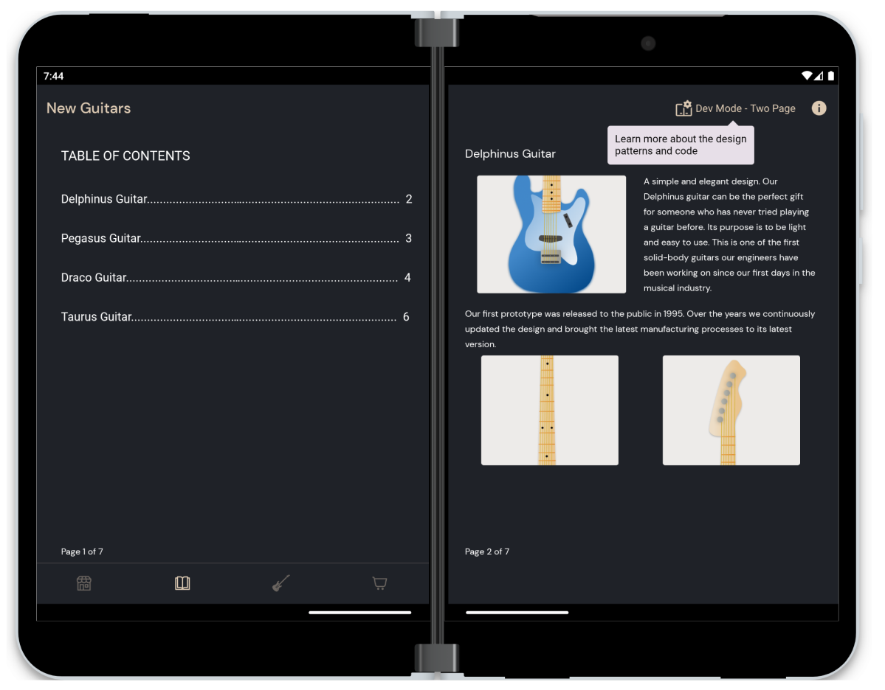
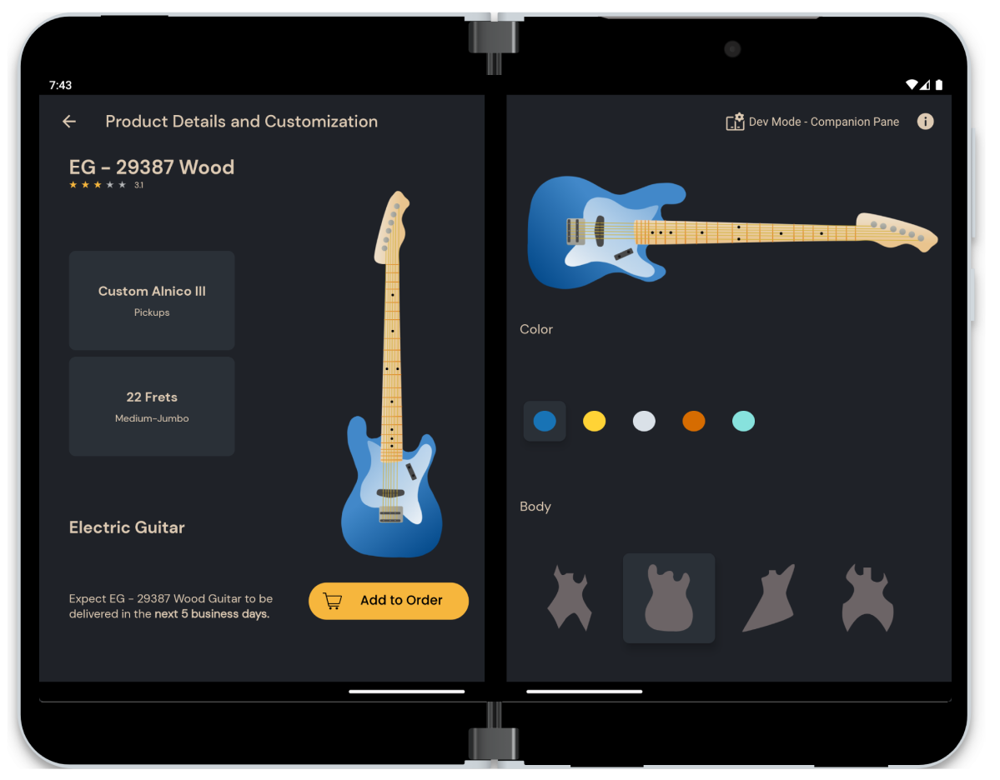
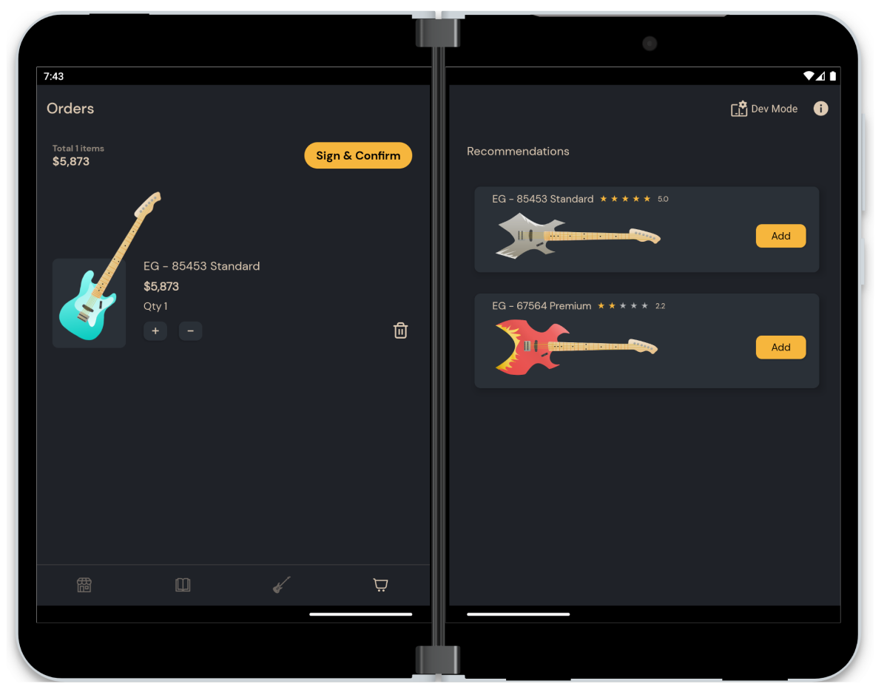

# Dual Screen Experience Example

The application provides developers and designers with real world, working examples of how to make 
use of the dual-screen/foldable form factor in different ways. It enables an end-to-end experience 
using a prescribed user scenario, centered around the needs of a travelling salesperson who visits 
various fictitious stores which are interested in buying the salespersons’ fictitious products. 
It helps the salesperson select and navigate to multiple predetermined customer locations in a city, 
assist the salespersons tasks in various ways during the visit to each potential client and create 
a report of each visit.

When spanned across the folding feature, a Developer Mode option appears in the toolbar which shows 
more details regarding each screen - the code behind it, the [user interface patterns](https://docs.microsoft.com/dual-screen/introduction#dual-screen-app-patterns) 
it implements and the [dual-screen controls](https://docs.microsoft.com/dual-screen/android/api-reference/dualscreen-library/) it uses.

## Install from Google Play Store

If you want to try out the released version, you can find it here:

## Getting Started

To learn how to load your app on the Surface Duo emulator, see the [documentation](https://docs.microsoft.com/dual-screen/android), and follow [the blog](https://devblogs.microsoft.com/surface-duo).

## Screenshots

## Related links

- [SDK open-source code](https://github.com/microsoft/surface-duo-sdk)
- [SDK samples (Kotlin)](https://github.com/microsoft/surface-duo-sdk-samples-kotlin)
- [SDK samples (Java)](https://github.com/microsoft/surface-duo-sdk-samples)
- [App samples](https://github.com/microsoft/surface-duo-app-samples)
- [Jetpack Window Manager samples](https://github.com/microsoft/surface-duo-window-manager-samples)
- [Jetpack Compose samples](https://github.com/microsoft/surface-duo-compose-samples)
- [Unity samples](https://github.com/microsoft/surface-duo-sdk-unity-samples)
- [Xamarin samples](https://github.com/microsoft/surface-duo-sdk-xamarin-samples)
- [Flutter samples](https://github.com/microsoft/surface-duo-sdk-samples-flutter)
- [React Native samples](https://github.com/microsoft/react-native-dualscreen)

## Contributing

This project welcomes contributions and suggestions. Most contributions require you to agree to a
Contributor License Agreement (CLA) declaring that you have the right to, and actually do, grant us
the rights to use your contribution. For details, visit https://cla.opensource.microsoft.com.

When you submit a pull request, a CLA bot will automatically determine whether you need to provide
a CLA and decorate the PR appropriately (e.g., status check, comment). Simply follow the instructions
provided by the bot. You will only need to do this once across all repos using our CLA.

This project has adopted the [Microsoft Open Source Code of Conduct](https://opensource.microsoft.com/codeofconduct/).
For more information see the [Code of Conduct FAQ](https://opensource.microsoft.com/codeofconduct/faq/) or
contact [opencode@microsoft.com](mailto:opencode@microsoft.com) with any additional questions or comments.

## Trademarks

This project may contain trademarks or logos for projects, products, or services. Authorized use of Microsoft trademarks or logos is subject to and must follow [Microsoft’s Trademark & Brand Guidelines](https://www.microsoft.com/en-us/legal/intellectualproperty/trademarks/usage/general). Use of Microsoft trademarks or logos in modified versions of this project must not cause confusion or imply Microsoft sponsorship. Any use of third-party trademarks or logos are subject to those third-party’s policies.

## License

Copyright (c) Microsoft Corporation.

MIT License

Permission is hereby granted, free of charge, to any person obtaining a copy of this software and associated documentation files (the "Software"), to deal in the Software without restriction, including without limitation the rights to use, copy, modify, merge, publish, distribute, sublicense, and/or sell copies of the Software, and to permit persons to whom the Software is furnished to do so, subject to the following conditions:

The above copyright notice and this permission notice shall be included in all copies or substantial portions of the Software.

THE SOFTWARE IS PROVIDED AS IS, WITHOUT WARRANTY OF ANY KIND, EXPRESS OR IMPLIED, INCLUDING BUT NOT LIMITED TO THE WARRANTIES OF MERCHANTABILITY, FITNESS FOR A PARTICULAR PURPOSE AND NONINFRINGEMENT. IN NO EVENT SHALL THE AUTHORS OR COPYRIGHT HOLDERS BE LIABLE FOR ANY CLAIM, DAMAGES OR OTHER LIABILITY, WHETHER IN AN ACTION OF CONTRACT, TORT OR OTHERWISE, ARISING FROM, OUT OF OR IN CONNECTION WITH THE SOFTWARE OR THE USE OR OTHER DEALINGS IN THE SOFTWARE.
